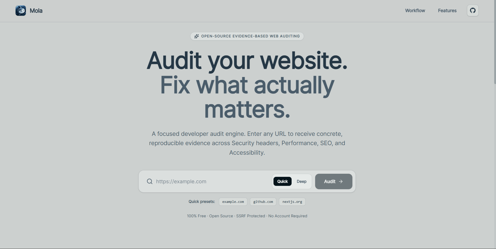
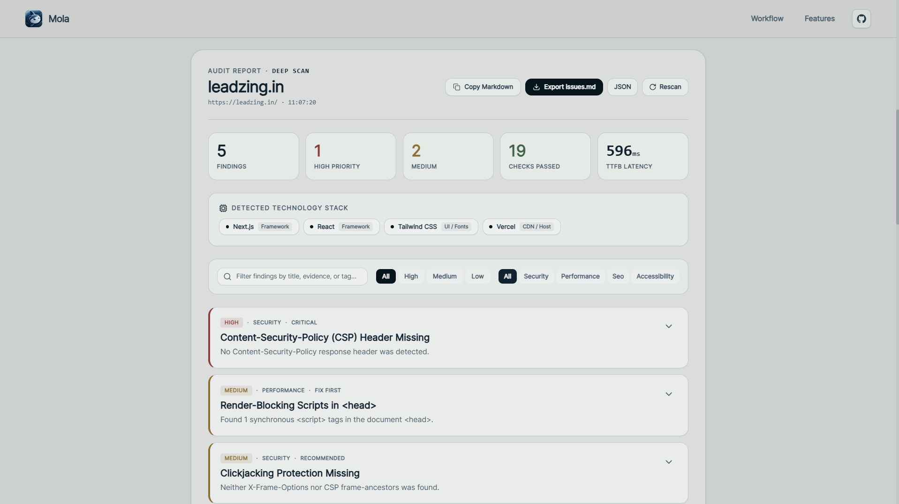
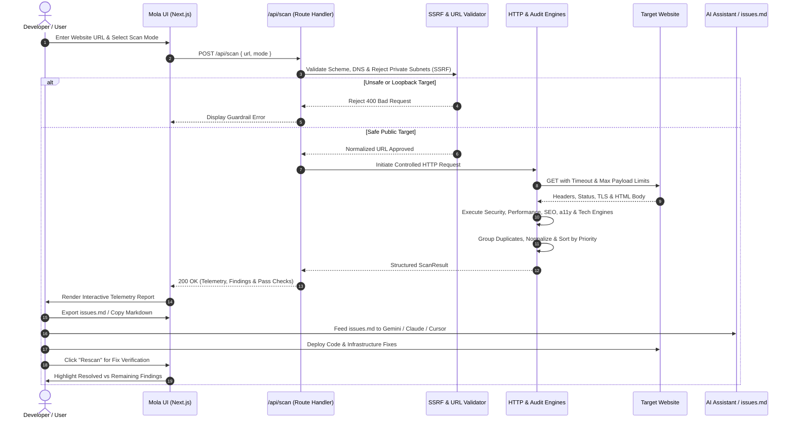

<p align="center">
  <a href="https://mola.antideploy.app">
    
  </a>
</p>

<div align="center">

# Mola

### The open-source evidence-based web auditing & telemetry engine for developers. Non-destructive URL inspection, security header analysis, and deterministic finding correlation with AI-ready `issues.md` exports.

<br/>

<a href="#-quick-start"></a>
<a href="https://mola.antideploy.app"></a>
<a href="https://github.com/mizan989/Mola-Web_Auditor/discussions"></a>

<a href="#-ways-to-run-mola"></a>
<a href="https://mola.antideploy.app"></a>

<a href="https://github.com/mizan989/Mola-Web_Auditor/stargazers"></a>
<a href="LICENSE"></a>
<a href="https://nextjs.org"></a>
<a href="https://react.dev"></a>
<a href="https://www.typescriptlang.org"></a>
<a href="https://tailwindcss.com"></a>
<a href="https://antideploy.com"></a>

</div>

> [!TIP]
> **Live Web Auditor Ready!** Audit any public website live at **[mola.antideploy.app](https://mola.antideploy.app)** to receive concrete evidence, HTTP telemetry, and one-click `issues.md` exports for AI coding assistants (Gemini, Claude, Cursor) — [Get started locally in under 60 seconds](#-quick-start).

---

## Mola Overview

Mola is an open-source, evidence-first web auditing engine built for developers who want a fast, understandable, and reproducible way to diagnose issues across any website. Rather than overwhelming engineers with arbitrary vanity scores, decorative 0–100 rings, or opaque black-box recommendations, Mola surfaces concrete technical observations: raw response headers, observed element tags, measured network timings, and prioritized code remediation snippets.

Every finding explains what was detected, displays the exact evidence, identifies the affected element or header, clarifies why it matters, and provides an actionable code snippet to fix it.

$$\text{Enter URL} \longrightarrow \text{Validate SSRF} \longrightarrow \text{Inspect Telemetry} \longrightarrow \text{Audit Engines} \longrightarrow \text{Export issues.md} \longrightarrow \text{Verify Fix}$$

**Key Capabilities:**

- **Evidence-First Technical Reporting** — Every audit finding includes raw observed evidence, response headers, or affected DOM snippets rather than speculative assumptions
- **Zero Vanity Scores** — Replaces arbitrary percentage scores with ranked, actionable engineering priorities (`High`, `Medium`, `Low`, and `Fix First`)
- **Deep HTTP & Infrastructure Telemetry** — Inspects TTFB latency, TLS protocols, HTTP compression (Brotli/Gzip/Zstandard), redirect chains, and server headers
- **Automated Technology Fingerprinting** — Detects underlying frameworks (Next.js, React, Vue, Nuxt), CDNs (Cloudflare, Vercel, Netlify), and CMS engines
- **AI-Ready `issues.md` Artifact Generation** — One-click download or copy of structured Markdown reports specifically engineered to prompt AI coding agents (Gemini, Claude, Cursor, Copilot)
- **Fix Verification & Rescan Diffing** — Re-auditing a site compares subsequent scan runs against previous baselines, clearly segregating `🟢 Resolved`, `🟡 Remaining`, and `🔴 New Issues`
- **SSRF-Hardened Network Architecture** — Built-in RFC 1918 private IP range blocking, loopback mitigation, cloud metadata (`169.254.169.254`) isolation, and domain guardrails
- **Ephemeral In-Memory Scanning** — Audits are executed ephemerally in memory without application database persistence or tracking cookies. Note that upstream hosting infrastructure or edge CDNs may retain standard operational access logs.
- **Quiet Developer Aesthetic** — Minimalist editorial layout, high-contrast typography, and full-viewport section views optimized for desktop and mobile

<br>

<div align="center">
  <pre>
┌─────────────────────────────────────────────────────────────────────────────────┐
│                                     MOLA                                        │
│        Target Input ➔ SSRF Validation ➔ HTTP Telemetry ➔ Audit Engines          │
├───────────────────────────────┬─────────────────────────────────────────────────┤
│  🛡️ Security Header Engine    │  ⚡ Performance & Asset Engine                   │
│   • CSP, HSTS, X-Frame-Options│    • TTFB Latency Benchmark                     │
│   • Referrer & Permissions    │    • Compression (Brotli/Gzip)                  │
│   • Version Banner Leakage    │    • Render-blocking scripts                    │
├───────────────────────────────┼─────────────────────────────────────────────────┤
│  🔍 SEO & Heading Hierarchy   │  ♿ Accessibility (a11y) Verification            │
│   • Title, Meta Description   │    • Image alt completeness                     │
│   • OpenGraph & Canonical     │    • HTML lang attribute                        │
│   • Heading levels (h1-h6)    │    • Semantic landmark navigation               │
├───────────────────────────────┼─────────────────────────────────────────────────┤
│  📊 Technology Detection      │  🔁 Fix Verification & Export                   │
│   • Frameworks (Next/React)   │    • issues.md Markdown Export                  │
│   • CMS (WordPress/Shopify)   │    • Structured JSON Export                     │
│   • CDN & Edge Servers        │    • Before/After Fix Verification Loop         │
└───────────────────────────────┴─────────────────────────────────────────────────┘
  </pre>
</div>

---

## UI Preview

<p align="center">
  
</p>

<br/>

<p align="center">
  
</p>

---

## Audit Assessment Sequence Flow



---

## Use Cases

- **Pre-Deployment Production Checklist** — Audit staging or production URLs to catch missing security headers, uncompressed payloads, and missing tags before public launches
- **Security Posture & Header Auditing** — Validate Content-Security-Policy (CSP), Strict-Transport-Security (HSTS), frame-ancestors, and cookie flags across client websites
- **SEO & Search Indexing Diagnostics** — Check canonical URLs, meta descriptions, title tag lengths, and heading hierarchy structures
- **Accessibility & UX Compliance** — Pinpoint unlabelled form controls, missing image `alt` attributes, and absent root language declarations
- **Competitive & Technology Intelligence** — Discover frameworks, CDN edge providers, server types, and reverse proxy architectures powering competitor domains
- **AI-Assisted Automated Remediation** — Export standardized `issues.md` reports and feed them directly into AI coding agents to automate code changes
- **Fix Verification & Regression Testing** — Re-audit after deploying fixes to confirm resolved items and guarantee that no new defects were introduced
- **Client & Stakeholder Reporting** — Generate clean, verifiable evidence summaries without vanity badges to substantiate engineering recommendations

---

## 🚀 Quick Start

**Prerequisites:**
- **Node.js**: `v18.17.0` or higher (tested on Node v20 & v24)
- **npm**, **pnpm**, or **yarn**

### Installation & First Run

```bash
# 1. Clone the repository
git clone https://github.com/mizan989/Mola-Web_Auditor.git
cd Mola-Web_Auditor

# 2. Install dependencies
npm install

# 3. Start the development server
npm run dev
```

Open **[http://localhost:3000](http://localhost:3000)** in your browser to begin auditing.

> [!NOTE]
> Mola operates 100% statelessly without external database requirements. Out of the box, all scanning, SSRF protection, telemetry parsing, and export generation run locally in volatile memory.

---

## Ways to Run Mola

- **Live Cloud Production** — Hosted live on Antideploy with continuous container deployment. [Try Live App](https://mola.antideploy.app)
- **Local Development** — Runs with hot-reloading using Next.js 16 and Turbopack. [Quick Start](#-quick-start)
- **Production Container Build** — Compile optimized server bundle (`npm run build`) and serve via Node.js runtime (`npm start`).

---

## ☁️ Auditor Workspaces & Views

Mola delivers dedicated interfaces tailored for the web auditing lifecycle:

- **Instant Audit Hub (`/`)** — Clean, distraction-free search input with suggested URL presets, scan mode toggle (Quick vs. Deep), and real-time stage progress tracker
- **Findings Telemetry & Priority Engine** — Categorized cards with severity filters (`High`, `Medium`, `Low`, `Fix First`), raw evidence inspect drawers, and one-click copyable remediation code
- **Technology & Infrastructure Inspector** — Live breakdown of server headers, TTFB response benchmarks, HTTP protocol versions, SSL/TLS status, and framework detection
- **Fix Verification & Rescan Comparator** — Automatic diffing banner comparing successive scan runs to highlight `🟢 Resolved`, `🟡 Remaining`, and `🔴 New Issues`
- **AI-Ready Export Studio** — One-click markdown (`issues.md`) generation formatted specifically for prompt-based coding assistants, alongside raw JSON downloads

---

## 🤖 Use Mola with Coding Agents

Mola is specifically designed to bridge the gap between audit discovery and resolution via modern AI coding assistants (Gemini, Claude, Cursor, GitHub Copilot).

### 1. Exporting `issues.md`

Click **Export issues.md** on any completed audit to generate a self-contained markdown file structured for LLM ingestion:

```markdown
# Audit Issues & Recommendations — example.com

> **Audit Metadata**
> - Target: `https://example.com`
> - Total Findings: 15 (High: 4, Medium: 5, Low: 6)

## Prioritized Action Items

### 1. [HIGH] Content-Security-Policy (CSP) Header Missing
- **Category**: `security`
- **Priority**: `CRITICAL`
- **Affected Target**: `HTTP Response Headers`
- **Why It Matters**: A robust CSP acts as a defense-in-depth shield against XSS...

**Concrete Evidence:**
```text
response.headers["content-security-policy"] → undefined
```

**Recommended Fix:**
Define a strict Content-Security-Policy header restricting script execution.
```nginx
add_header Content-Security-Policy "default-src 'self'; script-src 'self'; object-src 'none';" always;
```
```

### 2. Prompting Your Coding Agent

Provide `issues.md` directly to **Google Gemini**, **Claude**, **Cursor**, or **GitHub Copilot**:

> *"Here is the `issues.md` report from Mola Web Auditor. Fix the critical security headers in our reverse proxy configuration and add missing image dimensions in our React templates."*

### 3. Executing Audits via API

Coding agents can also invoke the API endpoint directly to programmatically audit target URLs:

```bash
curl -X POST https://mola.antideploy.app/api/scan \
  -H "Content-Type: application/json" \
  -d '{"url": "https://example.com", "mode": "quick"}'
```

The endpoint returns structured JSON conforming to the audit schema, including `findings`, `passedChecks`, `httpInfo`, `technologies`, and `performanceMetrics`.

---

## ✨ Features

### Evidence-First Observation Engine

Every finding produced by Mola is grounded in direct, reproducible observations:
- **Raw Headers**: Exact header keys and missing directives surfaced verbatim.
- **Affected Elements**: CSS selectors, tag names, and element code snippets extracted directly from HTML.
- **Measurable Metrics**: Microsecond-accurate TTFB timings and byte compression ratios.

### Zero Vanity Scores

Traditional audit suites rely on synthetic scores that reward superficial optimizations while ignoring fundamental vulnerabilities. Mola provides:
- **Ranked Engineering Priorities**: Actionable severity tiers (`High`, `Medium`, `Low`, `Fix First`).
- **Impact-Based Ordering**: Issues that expose sites to security breaches or search indexing failure are highlighted first.
- **Passed Checks Audit**: Clear visibility into what is already configured correctly.

### SSRF-Hardened Security Architecture

Auditing arbitrary URLs poses severe Server-Side Request Forgery risks. Mola implements hardened defense-in-depth controls:
- **Protocol & Port Restrictions**: Only `http:` and `https:` schemes with standard ports (80, 443) are permitted. Schemes such as `file:`, `ftp:`, `data:`, and `javascript:` as well as arbitrary ports are rejected.
- **SSRF Redirect Traversal Protection**: Redirects are manually followed and validated hop-by-hop (up to 5 maximum redirects); every destination undergoes strict IP and DNS re-validation to prevent private redirection.
- **Private IP & DNS Rebinding Defenses**: Centralized validation strictly blocks RFC 1918 subnets (`10.0.0.0/8`, `172.16.0.0/12`, `192.168.0.0/16`), carrier-grade NAT (`100.64.0.0/10`), link-local (`169.254.0.0/16`), loopback (`127.0.0.0/8`), IPv6 unique local (`fc00::/7`), link-local (`fe80::/10`), and IPv4-mapped IPv6 ranges. All resolved addresses from DNS are verified.
- **Resource & Concurrency Limits**: Strict 15-second operation deadlines, 2.5MB response body streaming caps, 4KB request body limits, 15 requests/min per IP rate limiting, and 5 concurrent active scan limits prevent resource exhaustion.

### Scan Modes: Quick Scan vs. Deep Scan

Mola provides two genuinely differentiated scan modes:
- **Quick Scan**: Fast, lightweight static document and network inspection. Collects HTTP telemetry (TTFB, protocol, status), response security headers, HTML document hygiene (titles, descriptions, canonicals, heading hierarchy), basic accessibility landmarks, and signature-verified technology detection.
- **Deep Scan**: Comprehensive audit expanding upon Quick Scan with in-depth static document checks:
  - **Subresource Integrity (SRI)**: Audits external third-party `<script>` tags for missing `integrity` attributes.
  - **Cookie Security Attributes**: Evaluates `Set-Cookie` directives for `Secure`, `HttpOnly`, and `SameSite` flags.
  - **Iframe Sandboxing & Lazy Loading**: Inspects `<iframe>` elements for `sandbox` policies and `loading="lazy"` attributes.

---

## Core Audit Engines & Rules Matrix

Mola runs checks across five primary disciplines plus technology and network infrastructure discovery:

| Category | Checks & Rules | Detection Method | Severity |
|---|---|---|---|
| **Security** | Content-Security-Policy (CSP) | Analyzes `Content-Security-Policy` header presence and flags `'unsafe-inline'` / `'unsafe-eval'` | **HIGH** |
| **Security** | Strict-Transport-Security (HSTS) | Verifies `Strict-Transport-Security` header with minimum 1-year max-age on HTTPS | **HIGH** |
| **Security** | Clickjacking Defenses | Checks for `X-Frame-Options` or CSP `frame-ancestors` directives | **MEDIUM** |
| **Security** | MIME-Type Sniffing Protection | Verifies `X-Content-Type-Options: nosniff` | **MEDIUM** |
| **Security** | Insecure Mixed Content | Detects unencrypted `http://` scripts, stylesheets, and images on HTTPS hosts | **HIGH** |
| **Security** | Version Banner Leakage | Flags exact daemon versions in `Server` or `X-Powered-By` headers | **LOW** |
| **Performance** | TTFB Latency Benchmark | Measures Time-To-First-Byte against strict latency tiers (<300ms, 300–800ms, >800ms) | **HIGH / MED** |
| **Performance** | HTTP Payload Compression | Checks for modern Brotli (`br`), Gzip (`gzip`), or Zstandard (`zstd`) compression | **MEDIUM** |
| **Performance** | Render-Blocking Scripts | Detects synchronous `<script>` tags in `<head>` without `defer` or `async` | **MEDIUM** |
| **Performance** | Explicit Image Dimensions | Flags images missing `width` and `height` attributes to prevent Cumulative Layout Shift (CLS) | **LOW** |
| **SEO** | Document `<title>` Hygiene | Verifies `<title>` existence, minimum length (>15 chars), and maximum desktop limit (<70 chars) | **HIGH / LOW** |
| **SEO** | Meta Description | Evaluates `<meta name="description">` presence and optimal character length (50–160 chars) | **MEDIUM** |
| **SEO** | Canonical Link Declaration | Checks for `<link rel="canonical">` to prevent duplicate indexing penalties | **MEDIUM** |
| **SEO** | Heading Hierarchy (H1) | Enforces single primary `<h1>` presence and validates logical heading nesting | **MEDIUM / LOW** |
| **SEO** | OpenGraph & Social Metadata | Validates `og:title` and `og:image` tags for link preview generation | **LOW** |
| **Accessibility** | Image `alt` Text Audit | Identifies images lacking descriptive `alt` attributes, providing element snippets | **HIGH** |
| **Accessibility** | Root Language Definition | Verifies valid BCP 47 `lang` attribute on the root `<html>` element | **HIGH** |
| **Accessibility** | Form Control Labeling | Detects input fields lacking associated `<label>`, `aria-label`, or accessible names | **MEDIUM** |
| **Accessibility** | Semantic Landmarks | Confirms presence of `<main>`, `<header>`, and landmark containers | **LOW** |
| **Best Practices** | Modern HTML5 DOCTYPE | Detects legacy quirks-mode triggers by verifying `<!DOCTYPE html>` | **MEDIUM** |
| **Best Practices** | UTF-8 Character Encoding | Confirms explicit `<meta charset="utf-8">` declaration | **LOW** |
| **Best Practices** | Obsolete Markup Scrutiny | Identifies deprecated tags (`<center>`, `<font>`, `<marquee>`, `<blink>`) | **LOW** |

---

## ⚙️ Configuration & Environment

Mola runs out of the box with zero required environment variables. Optional configurations can be specified in `.env.local`:

```env
PORT=3000
HOSTNAME=0.0.0.0
```

---

## 📂 Architecture & Code Structure

```text
d:/PROJECTS/Mola/
├── .antideploy.json             # Antideploy configuration (mola.antideploy.app)
├── .github/
│   └── workflows/
│       └── ci.yml               # GitHub Actions CI workflow
├── app/
│   ├── api/
│   │   └── scan/
│   │       └── route.ts          # Rate-limited & SSRF-isolated scan API route
│   ├── components/
│   │   ├── ExportControls.tsx    # Grouped Markdown & JSON export actions
│   │   ├── FindingFilters.tsx    # Search, severity, and category filter bar
│   │   ├── FindingItem.tsx       # Standardized finding card with ordered evidence
│   │   ├── FindingList.tsx       # Finding card container & telemetry views
│   │   ├── HeroSection.tsx       # Focused URL input & scan controls
│   │   ├── ReportSummary.tsx     # Audit metadata & severity breakdown
│   │   ├── ScanProgress.tsx      # Stage-based deterministic progress indicator
│   │   └── VerificationSection.tsx # 4-way Fix Verification presentation
│   ├── globals.css               # Design tokens & Tailwind CSS v4 setup
│   ├── layout.tsx                # Root layout, metadata & brand navbar
│   └── page.tsx                  # Interactive Auditor application UI
├── assets/
│   ├── logo.png                  # High-resolution brand mark (512x512)
│   ├── screenshot1.png           # Hero UI preview
│   └── screenshot2.png           # Telemetry & verification UI preview
├── lib/
│   ├── compare.ts                # Semantic finding comparison engine
│   ├── exportJson.ts             # JSON export & file download helpers
│   └── exportMarkdown.ts         # issues.md Markdown generator
├── server/
│   ├── orchestrator.ts           # Scan pipeline & verification comparator
│   ├── scanners/
│   │   ├── a11y.ts               # Accessibility (alt, lang, form labels)
│   │   ├── bestPractices.ts      # Doctype, UTF-8, deprecated markup
│   │   ├── deep.ts               # Deep scan (SRI, cookies, iframe sandboxing)
│   │   ├── http.ts               # Streaming HTTP telemetry & redirect handler
│   │   ├── performance.ts        # TTFB, compression, caching, scripts
│   │   ├── security.ts           # CSP, HSTS, X-Frame, mixed content
│   │   ├── seo.ts                # Title, meta description, canonical, h1-h6
│   │   └── tech.ts               # Evidence-based technology detection
│   └── validators/
│       ├── dns.ts                # Multi-record DNS resolution & rebinding defense
│       ├── ip.ts                 # Centralized IPv4 & IPv6 SSRF validator
│       └── url.ts                # URL syntax, protocol, and port validator
├── tests/
│   ├── a11y-label.test.ts        # Accessible form label unit tests
│   ├── compare-verification.test.ts # Semantic verification diff tests
│   ├── exports.test.ts           # issues.md & verification markdown tests
│   ├── ip-validation.test.ts     # IPv4 & IPv6 SSRF range tests
│   ├── limits-redirects.test.ts  # Resource & redirect limit tests
│   ├── tech-detection.test.ts    # Technology heuristic & evidence tests
│   └── url-validation.test.ts    # URL & port restriction unit tests
├── types/
│   └── audit.ts                  # Finding, Result & Verification schemas
├── eslint.config.mjs             # ESLint configuration
├── LICENSE                       # MIT License
├── next.config.ts                # Next.js security headers configuration
├── package.json                  # Dependencies & scripts
├── tsconfig.json                 # Strict TypeScript configuration
└── README.md                     # Project overview & documentation
```

---

## ☁️ Cloud Deployment

Mola is deployed and hosted on **Antideploy** with continuous integration on every push:

- **Production URL**: [https://mola.antideploy.app](https://mola.antideploy.app)
- **Deployment Spec**: [`.antideploy.json`](.antideploy.json) links to the project and triggers builds on each commit to `main`.
- **Containerized Runtime**: Optimized Next.js 16 container, fully SSRF-hardened and ephemeral.

---

## Verification & Quality Bar

```bash
# Typecheck TypeScript codebase
npm run typecheck

# Lint codebase (0 errors, 0 warnings)
npm run lint

# Run automated unit tests
npm test

# Build optimized production bundle
npm run build

# Start production server
npm run start
```

---

## Contributing

We welcome contributions from the developer and security community!

1. Fork the repository
2. Create your feature branch (`git checkout -b feature/new-audit-rule`)
3. Commit your changes (`git commit -m 'feat: add cache-control audit rule'`)
4. Push to the branch (`git push origin feature/new-audit-rule`)
5. Open a [Pull Request](https://github.com/mizan989/Mola-Web_Auditor/pulls)

---

## Support the Project

**Enjoying Mola?** Give us a ⭐ on [GitHub](https://github.com/mizan989/Mola-Web_Auditor) to help others discover evidence-based web auditing!

---

## Acknowledgements

Mola is built with gratitude towards the open-source engineering ecosystem:

- [Next.js](https://nextjs.org/) & [React 19](https://react.dev/) — Modern React framework and server architecture
- [Tailwind CSS v4](https://tailwindcss.com/) — Modern utility-first styling engine
- [Lucide Icons](https://lucide.dev/) — Consistent, high-precision developer iconography
- [Antideploy](https://antideploy.com/) — Fast, zero-friction containerized cloud deployment

---

## 👤 Author

**Md Mizan**

- **GitHub**: [@mizan989](https://github.com/mizan989)
- **LinkedIn**: [in/mizan989](https://www.linkedin.com/in/mizan989)
- **Instagram**: [@mizan989](https://instagram.com/mizan989)
- **X (Twitter)**: [@mizan989](https://x.com/mizan989)
- **Repository**: [Mola-Web_Auditor](https://github.com/mizan989/Mola-Web_Auditor)
- **Live Site**: [mola.antideploy.app](https://mola.antideploy.app)

---

<div align="center">

> [!NOTE]
> **Audit Integrity & Non-Destructive Scanning:** Mola inspects observable public HTTP responses, TLS handshakes, and DOM structures. It strictly blocks loopback and private subnets, does not perform aggressive fuzzing, and respects remote server integrity.

</div>
