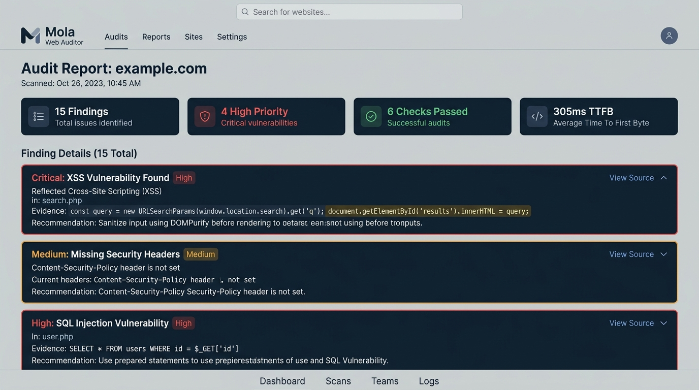
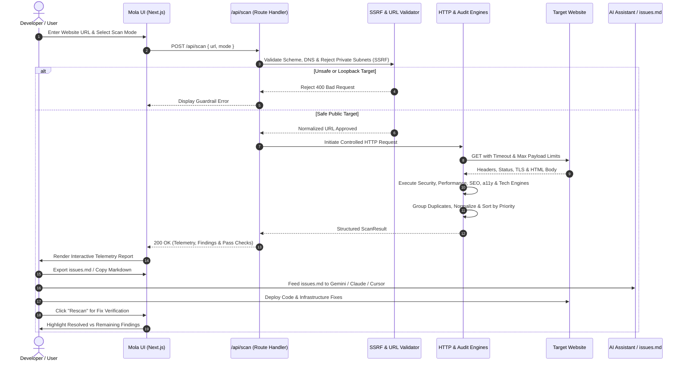

<p align="center">
  <a href="https://github.com/mizan989/Mola-Web_Auditor">
    
  </a>
</p>

<div align="center">

# Mola

### Minimal, Open-Source Web Auditing & Telemetry Engine for Developers. Non-destructive URL inspection, security header analysis, and deterministic finding correlation with AI-ready `issues.md` exports.

<br/>

<a href="#-quick-start"></a>
<a href="https://github.com/mizan989/Mola-Web_Auditor"></a>
<a href="https://github.com/mizan989/Mola-Web_Auditor/discussions"></a>

<a href="#-ways-to-run-mola"></a>
<a href="#-flagship-audit-workflow"></a>

<a href="https://github.com/mizan989/Mola-Web_Auditor/stargazers"></a>
<a href="LICENSE"></a>
<a href="https://nextjs.org"></a>
<a href="https://www.typescriptlang.org/"></a>
<a href="https://tailwindcss.com/"></a>
<a href="https://react.dev/"></a>

</div>

> [!TIP]
> **Developer Web Auditing Ready!** Enter any URL to receive concrete evidence, HTTP telemetry, and one-click `issues.md` exports for AI coding assistants (Gemini, Claude, Cursor) — [Get started locally in under 60 seconds](#-quick-start).

---

## Mola Overview

Mola is a minimal, evidence-first web auditing tool built for developers who want a fast, understandable way to discover problems in any website. Rather than overwhelming developers with arbitrary vanity scores, decorative 0–100 rings, or vague generalities, Mola provides concrete, verifiable observations. Every finding explains what was detected, displays the exact evidence, identifies the affected element or header, clarifies why it matters, and provides an actionable code snippet to fix it.

Mola is built around an intuitive engineering loop:

$$\text{Enter URL} \longrightarrow \text{Scan} \longrightarrow \text{Inspect Evidence} \longrightarrow \text{Fix} \longrightarrow \text{Verify}$$

**Key Capabilities:**

- **Evidence-First Technical Reporting** — Every audit finding includes raw observed evidence, response headers, or affected DOM snippets rather than speculative assumptions
- **Zero Vanity Scores** — Replaces arbitrary percentage scores with ranked, actionable engineering priorities (`High`, `Medium`, `Low` & `Fix First`)
- **Deep HTTP & Infrastructure Telemetry** — Inspects TTFB latency, TLS protocols, HTTP compression (Brotli/Gzip), redirect chains, and server headers
- **Automated Technology Fingerprinting** — Detects underlying frameworks (Next.js, React, Vue), CDNs (Cloudflare, Vercel, Netlify), and CMS engines
- **AI-Ready `issues.md` Artifact Generation** — One-click download or copy of structured Markdown reports specifically engineered to prompt AI coding agents (Gemini, Claude, Cursor, Copilot)
- **Fix Verification & Rescan Diffing** — Re-auditing a site compares subsequent scan runs against previous baselines, clearly segregating `🟢 Resolved`, `🟡 Remaining`, and `🔴 New Issues`
- **SSRF-Hardened Network Architecture** — Built-in RFC 1918 private IP range blocking, loopback mitigation, cloud metadata (169.254.169.254) isolation, and domain guardrails
- **100% Stateless & Private** — Pure ephemeral in-memory scan processing; zero database storage, zero tracking cookies, zero persistent URL logging

<br>

<div align="center">
  <pre>
┌─────────────────────────────────────────────────────────────────────────────────┐
│                                     MOLA                                        │
│        Target Input ➔ SSRF Validation ➔ HTTP Telemetry ➔ Audit Engines          │
├───────────────────────────────┬─────────────────────────────────────────────────┤
│  🛡️ Security Header Engine    │  ⚡ Performance & Asset Engine                   │
│   • CSP, HSTS, X-Frame-Options│    • TTFB Latency Benchmark                     │
│   • Referrer & Permissions    │    • Compression (Brotli/Gzip)                  │
│   • Version Banner Leakage    │    • Render-blocking scripts                    │
├───────────────────────────────┼─────────────────────────────────────────────────┤
│  🔍 SEO & Heading Hierarchy   │  ♿ Accessibility (a11y) Verification            │
│   • Title, Meta Description   │    • Image alt completeness                     │
│   • OpenGraph & Canonical     │    • HTML lang attribute                        │
│   • Heading levels (h1-h6)    │    • Semantic landmark navigation               │
├───────────────────────────────┼─────────────────────────────────────────────────┤
│  📊 Technology Detection      │  🔁 Fix Verification & Export                   │
│   • Frameworks (Next/React)   │    • issues.md Markdown Export                  │
│   • CMS (WordPress/Shopify)   │    • Structured JSON Export                     │
│   • CDN & Edge Servers        │    • Before/After Fix Verification Loop         │
└───────────────────────────────┴─────────────────────────────────────────────────┘
  </pre>
</div>

---

## UI Preview

<p align="center">
  
</p>

---

## Audit Assessment Sequence Flow



---

## Core Audit Engines & Rules Matrix

Mola runs checks across five primary disciplines plus technology and network infrastructure discovery:

| Category | Checks & Rules | Detection Method | Severity |
|---|---|---|---|
| **Security** | Content-Security-Policy (CSP) | Analyzes `Content-Security-Policy` header presence and flags `'unsafe-inline'` / `'unsafe-eval'` | **HIGH** |
| **Security** | Strict-Transport-Security (HSTS) | Verifies `Strict-Transport-Security` header with minimum 1-year max-age on HTTPS | **HIGH** |
| **Security** | Clickjacking Defenses | Checks for `X-Frame-Options` or CSP `frame-ancestors` directives | **MEDIUM** |
| **Security** | MIME-Type Sniffing Protection | Verifies `X-Content-Type-Options: nosniff` | **MEDIUM** |
| **Security** | Insecure Mixed Content | Detects unencrypted `http://` scripts, stylesheets, and images on HTTPS hosts | **HIGH** |
| **Security** | Version Banner Leakage | Flags exact daemon versions in `Server` or `X-Powered-By` headers | **LOW** |
| **Performance** | TTFB Latency Benchmark | Measures Time-To-First-Byte against strict latency tiers (<300ms, 300–800ms, >800ms) | **HIGH / MED** |
| **Performance** | HTTP Payload Compression | Checks for modern Brotli (`br`), Gzip (`gzip`), or Zstandard (`zstd`) compression | **MEDIUM** |
| **Performance** | Render-Blocking Scripts | Detects synchronous `<script>` tags in `<head>` without `defer` or `async` | **MEDIUM** |
| **Performance** | Explicit Image Dimensions | Flags images missing `width` and `height` attributes to prevent Cumulative Layout Shift (CLS) | **LOW** |
| **SEO** | Document `<title>` Hygiene | Verifies `<title>` existence, minimum length (>15 chars), and maximum desktop limit (<70 chars) | **HIGH / LOW** |
| **SEO** | Meta Description | Evaluates `<meta name="description">` presence and optimal character length (50–160 chars) | **MEDIUM** |
| **SEO** | Canonical Link Declaration | Checks for `<link rel="canonical">` to prevent duplicate indexing penalties | **MEDIUM** |
| **SEO** | Heading Hierarchy (H1) | Enforces single primary `<h1>` presence and validates logical heading nesting | **MEDIUM / LOW** |
| **SEO** | OpenGraph & Social Metadata | Validates `og:title` and `og:image` tags for link preview generation | **LOW** |
| **Accessibility** | Image `alt` Text Audit | Identifies images lacking descriptive `alt` attributes, providing element snippets | **HIGH** |
| **Accessibility** | Root Language Definition | Verifies valid BCP 47 `lang` attribute on the root `<html>` element | **HIGH** |
| **Accessibility** | Form Control Labeling | Detects input fields lacking associated `<label>`, `aria-label`, or accessible names | **MEDIUM** |
| **Accessibility** | Semantic Landmarks | Confirms presence of `<main>`, `<header>`, and landmark containers | **LOW** |
| **Best Practices** | Modern HTML5 DOCTYPE | Detects legacy quirks-mode triggers by verifying `<!DOCTYPE html>` | **MEDIUM** |
| **Best Practices** | UTF-8 Character Encoding | Confirms explicit `<meta charset="utf-8">` declaration | **LOW** |
| **Best Practices** | Obsolete Markup Scrutiny | Identifies deprecated tags (`<center>`, `<font>`, `<marquee>`, `<blink>`) | **LOW** |

---

## 🚀 Quick Start

### Prerequisites

- **Node.js**: `v18.17.0` or later (tested on Node v20 & v24)
- **npm**, **pnpm**, or **yarn**

### Installation

```bash
# 1. Clone the repository
git clone https://github.com/mizan989/Mola-Web_Auditor.git
cd Mola-Web_Auditor

# 2. Install dependencies
npm install

# 3. Start the development server
npm run dev
```

Open **[http://localhost:3000](http://localhost:3000)** in your browser.

### Production Build

```bash
# Compile optimized production bundle with TypeScript checks
npm run build

# Start the production server
npm run start
```

---

## 🛠️ Verification & AI Issue Artifact Workflow

Mola is specifically designed to bridge the gap between audit discovery and resolution via modern AI coding assistants.

### 1. Exporting `issues.md`

Click **Export issues.md** on any completed audit to generate a self-contained markdown file structured for LLM ingestion:

```markdown
# Audit Issues & Recommendations — example.com

> **Audit Metadata**
> - Target: `https://example.com`
> - Total Findings: 15 (High: 4, Medium: 5, Low: 6)

## Prioritized Action Items

### 1. [HIGH] Content-Security-Policy (CSP) Header Missing
- **Category**: `security`
- **Priority**: `CRITICAL`
- **Affected Target**: `HTTP Response Headers`
- **Why It Matters**: A robust CSP acts as a defense-in-depth shield against XSS...

**Concrete Evidence:**
```text
response.headers["content-security-policy"] → undefined
```

**Recommended Fix:**
Define a strict Content-Security-Policy header restricting script execution.
```nginx
add_header Content-Security-Policy "default-src 'self'; script-src 'self'; object-src 'none';" always;
```
```

### 2. Handing to Your Coding Agent

Provide `issues.md` directly to **Google Gemini**, **Claude**, **Cursor**, or **GitHub Copilot**:

> *"Here is the `issues.md` report from Mola Web Auditor. Fix the critical security headers in our reverse proxy configuration and add missing image dimensions in our React templates."*

### 3. The Fix-and-Verify Loop

Once fixes are deployed:
1. Re-run Mola against the target URL.
2. Mola automatically compares the new results against the previous run.
3. Review the **Fix Verification** banner:
   - 🟢 **Resolved**: Previous findings that are now confirmed fixed.
   - 🟡 **Remaining**: Findings that still require remediation.
   - 🔴 **New Issues**: Any newly introduced regressions.

---

## 🛡️ Security Posture & SSRF Guardrails

Auditing arbitrary URLs poses severe Server-Side Request Forgery (SSRF) risks. Mola implements hardened defense-in-depth controls defined in [`SECURITY.md`](SECURITY.md):

1. **Protocol Whitelisting** — Only `http:` and `https:` schemes are permitted. Schemes such as `file:`, `ftp:`, `data:`, and `javascript:` are immediately rejected.
2. **SSRF & Private IP Blocking** — All targets are validated prior to connection:
   - RFC 1918 Private Ranges (`10.0.0.0/8`, `172.16.0.0/12`, `192.168.0.0/16`)
   - Loopback Interfaces (`127.0.0.1`, `localhost`, `::1`)
   - Cloud Provider Metadata Endpoints (`169.254.169.254`, `metadata.google.internal`)
   - Carrier-Grade NAT (`100.64.0.0/10`) & Multicast (`224.0.0.0/4`)
   - Internal Domain Suffixes (`.local`, `.internal`, `.lan`, `.corp`, `.onion`)
3. **DoS & Resource Quotas** — 12-second hard abort timeouts and 5MB response payload caps prevent memory exhaustion attacks.
4. **Stateless Ephemeral Memory** — Mola does not maintain a database of scanned targets. Results reside only in volatile client/server memory.

---

## 📂 Repository Structure

```text
d:/PROJECTS/Mola/
├── app/
│   ├── api/
│   │   └── scan/
│   │       └── route.ts          # Secure scan API route handler
│   ├── privacy/
│   │   └── page.tsx              # Stateless privacy policy
│   ├── terms/
│   │   └── page.tsx              # Acceptable use terms
│   ├── globals.css               # Design tokens & Tailwind CSS v4 setup
│   ├── layout.tsx                # Root layout, metadata & brand navbar
│   └── page.tsx                  # Interactive Auditor application UI
├── assets/
│   ├── logo.png                  # High-resolution brand mark (512x512)
│   └── screenshot.png            # UI preview screenshot
├── lib/
│   ├── exportJson.ts             # JSON export & file download helpers
│   └── exportMarkdown.ts         # issues.md Markdown generator
├── public/
│   ├── apple-touch-icon.png      # Apple touch icon (180x180)
│   ├── favicon-32x32.png         # 32x32 Favicon
│   ├── favicon.ico               # Multi-size Favicon (16/32/48)
│   ├── icon-192.png              # PWA icon (192x192)
│   ├── logo.png                  # Brand logo
│   └── screenshot.png            # Static preview asset
├── server/
│   ├── orchestrator.ts           # Scan pipeline & verification comparator
│   ├── scanners/
│   │   ├── a11y.ts               # Accessibility (alt, lang, landmarks)
│   │   ├── bestPractices.ts      # Doctype, UTF-8, deprecated markup
│   │   ├── http.ts               # HTTP telemetry, headers, TLS, latency
│   │   ├── performance.ts        # TTFB, compression, caching, scripts
│   │   ├── security.ts           # CSP, HSTS, X-Frame, cookies, mixed content
│   │   ├── seo.ts                # Title, meta description, canonical, h1-h6
│   │   └── tech.ts               # Technology detection engine (Wappalyzer)
│   └── validators/
│       └── url.ts                # SSRF guardrails & IP allowlist validation
├── types/
│   └── audit.ts                  # Finding, Result & Verification schemas
├── next.config.ts                # Next.js security headers configuration
├── package.json                  # Dependencies & scripts
├── postcss.config.mjs            # Tailwind CSS PostCSS plugin
├── tsconfig.json                 # Strict TypeScript configuration
└── README.md                     # Project overview & documentation
```

---

## 📚 Architecture & Documentation Matrix

| Document | Purpose |
|---|---|
| [`PRD.md`](prd.md) | Product Requirements Document, user personas, and feature specifications |
| [`ARCHITECTURE.md`](ARCHITECTURE.md) | Detailed technical architecture, pipeline layers, and system constraints |
| [`RULES.md`](rules.md) | Development standards, AI agent boundaries, and coding conventions |
| [`SECURITY.md`](SECURITY.md) | Comprehensive threat model, SSRF defense architecture, and security policies |
| [`DESIGN.md`](design.md) | Visual design system, canonical color tokens, and UI/UX philosophy |
| [`README.md`](README.md) | Engineering overview, quickstart instructions, and capability matrix |

---

## 📄 License

Distributed under the **MIT License**. See `LICENSE` for more information.

---

## 👤 Author

**Md Mizan**

- GitHub: [@mizan989](https://github.com/mizan989)
- Repository: [Mola-Web_Auditor](https://github.com/mizan989/Mola-Web_Auditor)
